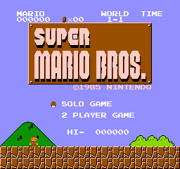

# Super Mario Bros. 1 (NES) Text Editor



This is a terminal-based text editor for Super Mario Bros. (NES). It has been
tested specifically on `Super Mario Bros. (World).nes`.

## Compilation instructions

    `gcc -Wall edit.c -o edit`

A release is also available.

## Sample run

    ```
        >edit "Super Mario Bros. (World).nes" output.nes
        HUD Elements:
                [ 1] MARIO (Offset: 0x0765)
                [ 2] LUIGI (Offset: 0x07fd)
                [ 3] WORLD (Offset: 0x076d)
                [ 4] TIME (Offset: 0x0774)
        Black Screen:
                [ 5] WORLD (Offset: 0x0796)
                [ 6] TIME UP (Offset: 0x07b3)
                [ 7] GAME OVER (Offset: 0x07c6)
        Toadstool's Retainers:
                [ 8] THANK YOU MARIO! (Offset: 0x0d67)
                [ 9] THANK YOU LUIGI! (Offset: 0x0d81)
                [10] BUT OUR PRINCESS IS IN (Offset: 0x0d8f)
                [11] ANOTHER CASTLE! (Offset: 0x0da8)
        Miscellaneous:
                [12] WELCOME TO WARP ZONE! (Offset: 0x07d3)
                [13] @1985 NINTENDO (Offset: 0x9fb5)
                [14] 1 PLAYER GAME (Offset: 0x9fc6)
                [15] 2 PLAYER GAME (Offset: 0x9fd6)
                [16] TOP- (Offset: 0x9fe6)
        Which text do you want to edit? (0 to quit): 13
                Please enter new text. (Max 14 chars)
                Do not exceed the length of the original text.
                @1985 NINTENDO|
                HELLO WORLD
                Writing HELLO WORLD to 9fb5...
        Which text do you want to edit? (0 to quit): 14
                Please enter new text. (Max 13 chars)
                Do not exceed the length of the original text.
                1 PLAYER GAME|
                EDUCATIONAL
                Writing EDUCATIONAL to 9fc6...
        Which text do you want to edit? (0 to quit): 15
                Please enter new text. (Max 13 chars)
                Do not exceed the length of the original text.
                2 PLAYER GAME|
                PURPOSES ONLY
                Writing PURPOSES ONLY to 9fd6...
        Which text do you want to edit? (0 to quit): 0
    ```

## reader.c

Another program, `reader.c`. is also included in this repository. It prints
out the contents of a Super Mario Bros. (NES) `.nes` file in ASCII for every
byte it can.
